# Smart Security Pad 🔐📱

Smart Security Pad is an IoT-based item protection and theft detection system designed to provide real-time monitoring and instant alerts for valuable objects. Unlike traditional security systems that monitor only surrounding areas, this project focuses on protecting the object itself using sensors and mobile notifications.

---

## 🚀 Features

- Real-time item monitoring
- Pressure and movement detection
- Instant mobile notifications
- Firebase integration
- Android application support
- Wi-Fi based communication
- Portable and low-cost solution
- User-friendly interface

---

## 🏗️ Application Flow

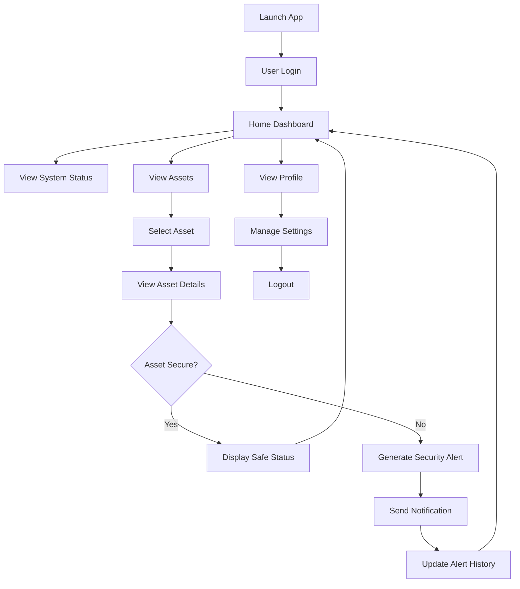

---

## 🛠️ Technologies Used

### Hardware
- ESP8266 / Arduino
- Pressure Sensor
- Motion Sensor
- Wi-Fi Module

### Software
- Android Studio
- Java / Kotlin
- Firebase
- IoT APIs

---

## 📱 Mobile Application

The Android application allows users to:
- Monitor item status in real-time
- Receive instant theft alerts
- Track unauthorized movement detection
- Connect with the IoT device through Firebase

---

## ⚙️ Working Principle

1. User places an item on the smart pad
2. Sensors record baseline pressure
3. System continuously monitors movement/activity
4. If movement exceeds the threshold:
   - Microcontroller processes the signal
   - Alert is sent through Wi-Fi
   - User receives an instant notification

---

## 🧩 System Architecture

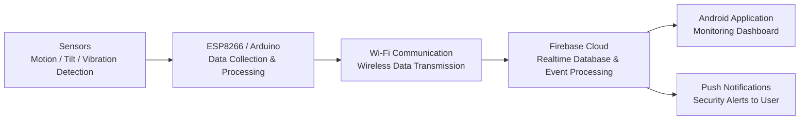

---

## 🧪 Testing

The project was tested using:
- Unit Testing
- Integration Testing
- System Testing
- User Acceptance Testing

### Results
- Response Time: 1–3 seconds
- Stable operation
- High detection accuracy

---

## 📌 Applications

- Libraries
- Offices
- Cafes
- Classrooms
- Public Spaces

---

## 📷 Application Walkthrough

| Splash Screen | Home Page Safe | Home Page Alert |
|-----------|-----------|--------------|
| 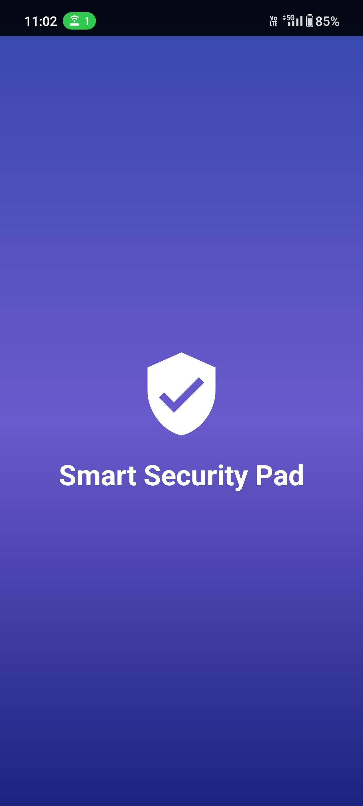 |  | 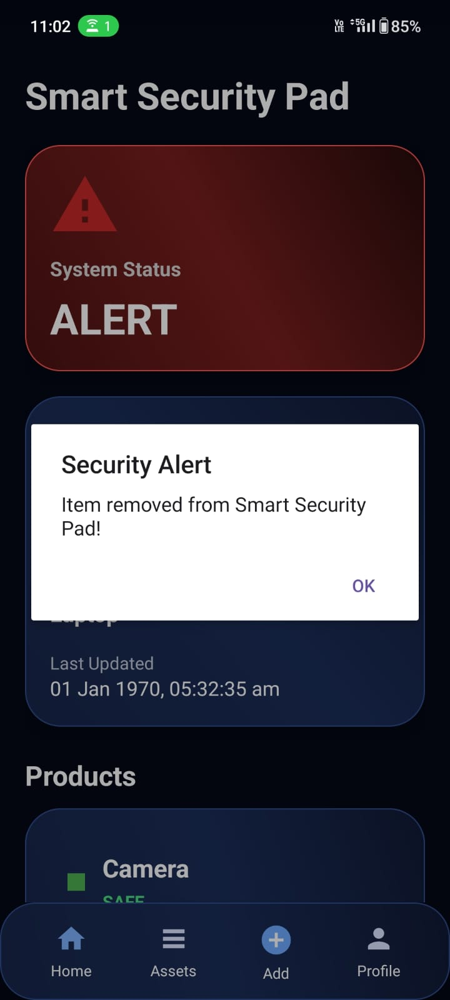 |

| Assets | Laptop  | Laptop |
|-----------|-----------|--------------|
| 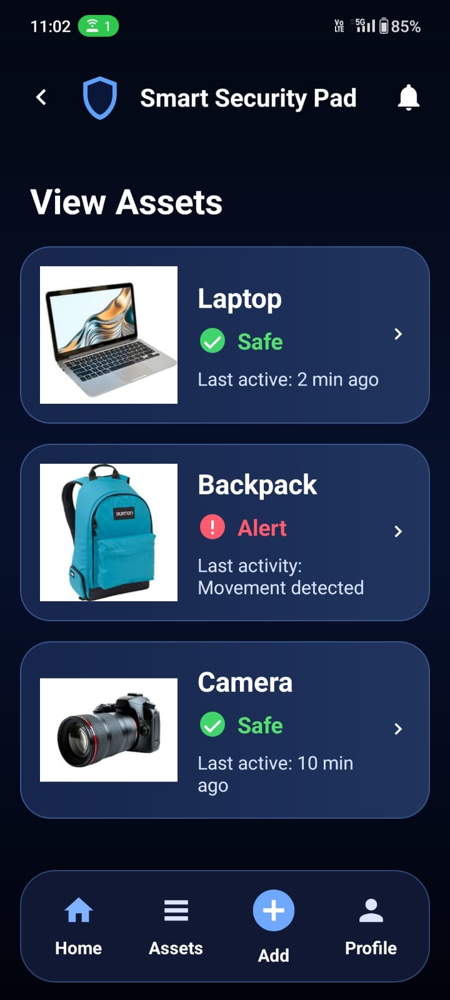 | 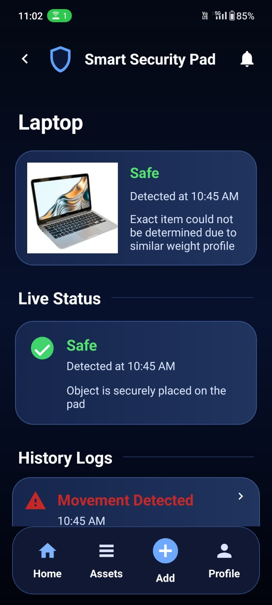 | 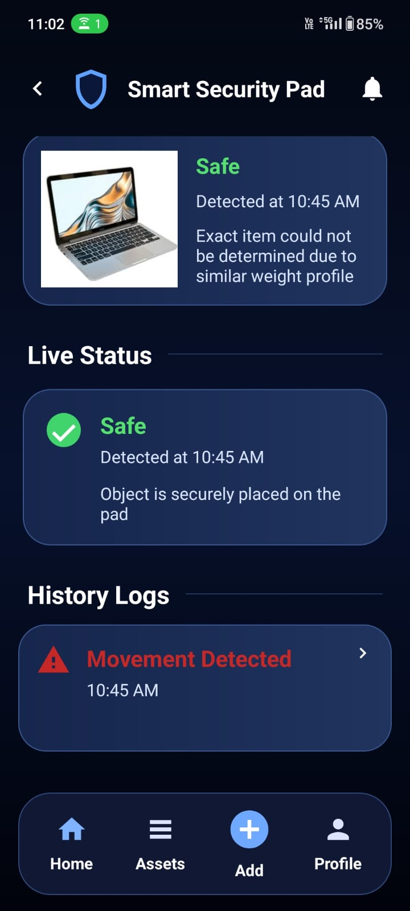 |

| Backpack | Backpack | Add Asset |
|-----------|-----------|--------------|
| 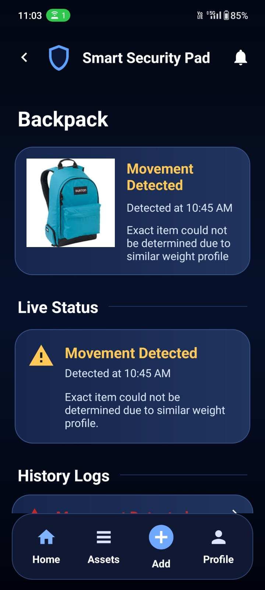 | 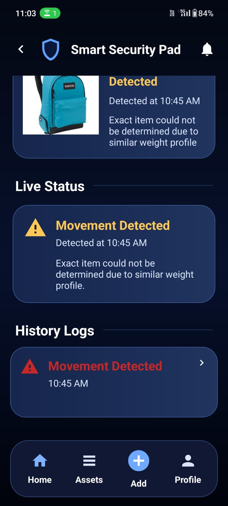 | 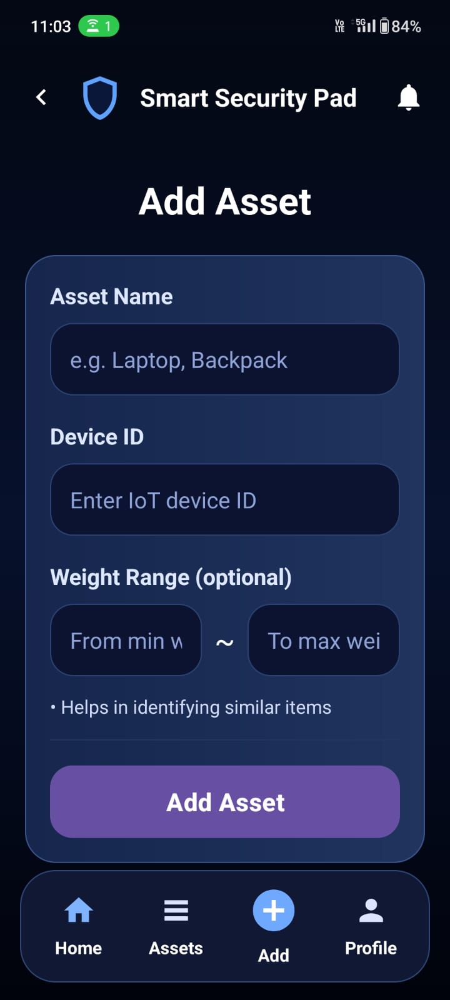 |

| Profile |
|-----------|
| 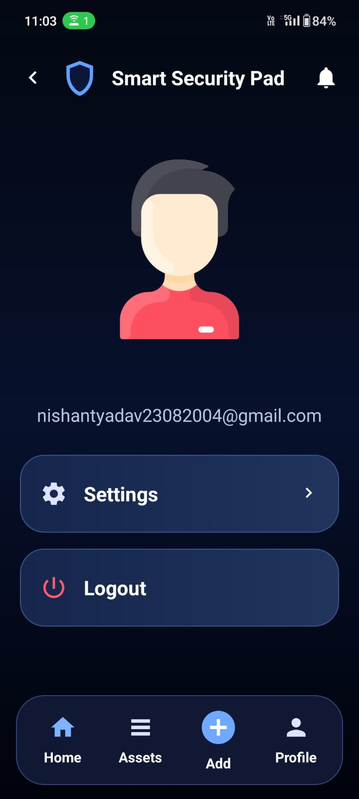 |

---

## 🎥 Project Demonstrations

Watch the complete application workflow below:

| 📱 Android App Demo | 🔧 Hardware Demo |
|--------------------|------------------|
| https://github.com/user-attachments/assets/54c265dd-84bb-4d23-88f0-405d80708534 | https://github.com/user-attachments/assets/4fe8a496-930a-47b4-97fb-64ff49987d51 |

---

## 🔮 Future Scope

- AI-based anomaly detection
- TinyML integration
- Blockchain-secured alerts
- Cloud synchronization
- GPS tracking integration

---
