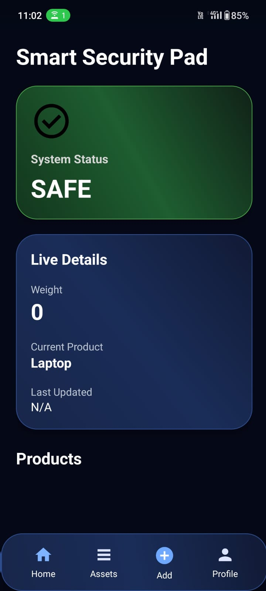

# Smart Security Pad 🔐📱

Smart Security Pad is an IoT-based item protection and theft detection system designed to provide real-time monitoring and instant alerts for valuable objects. Unlike traditional security systems that monitor only surrounding areas, this project focuses on protecting the object itself using sensors and mobile notifications.

---

## 🚀 Features

- Real-time item monitoring
- Pressure and movement detection
- Instant mobile notifications
- Firebase integration
- Android application support
- Wi-Fi based communication
- Portable and low-cost solution
- User-friendly interface

---

## 🛠️ Technologies Used

### Hardware
- ESP8266 / Arduino
- Pressure Sensor
- Motion Sensor
- Wi-Fi Module

### Software
- Android Studio
- Java / Kotlin
- Firebase
- IoT APIs

---

## 📱 Mobile Application

The Android application allows users to:
- Monitor item status in real-time
- Receive instant theft alerts
- Track unauthorized movement detection
- Connect with the IoT device through Firebase

---

## ⚙️ Working Principle

1. User places an item on the smart pad
2. Sensors record baseline pressure
3. System continuously monitors movement/activity
4. If movement exceeds the threshold:
   - Microcontroller processes the signal
   - Alert is sent through Wi-Fi
   - User receives an instant notification

---

## 🧩 System Architecture

Sensors → ESP8266/Arduino → Wi-Fi Communication → Firebase → Android App Notifications

---

## 🧪 Testing

The project was tested using:
- Unit Testing
- Integration Testing
- System Testing
- User Acceptance Testing

### Results
- Response Time: 1–3 seconds
- Stable operation
- High detection accuracy

---

## 🔮 Future Scope

- AI-based anomaly detection
- TinyML integration
- Blockchain-secured alerts
- Cloud synchronization
- GPS tracking integration

---

## 📌 Applications

- Libraries
- Offices
- Cafes
- Classrooms
- Public Spaces

---

## 📷 Screenshots

https://drive.google.com/drive/folders/13Q-cKNDPY8dfHwClsHAa9SIihMku5fVe?usp=sharing

---

## 🔗 Demo Video

1) App
https://drive.google.com/file/d/1xdqk9_mLSrhW_18Ebhyi5iH1jZWKcPO8/view?usp=sharing

2) Hardware
https://drive.google.com/file/d/1teqbFF3Ig1KtSHEtOGnKMVCoheQQaqlO/view?usp=sharing

---

## 📄 License

This project is for educational and research purposes.

  

